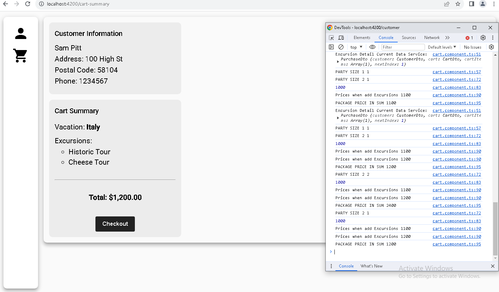
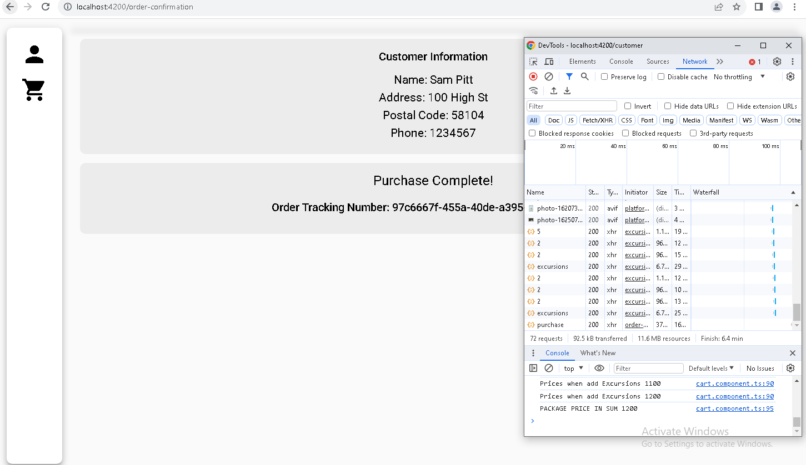
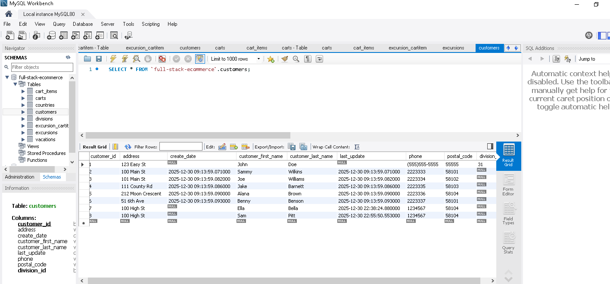
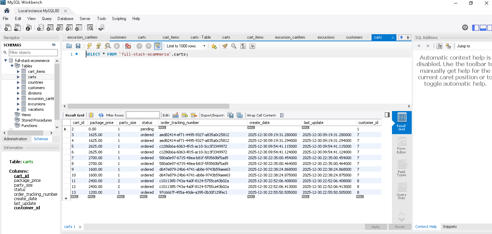
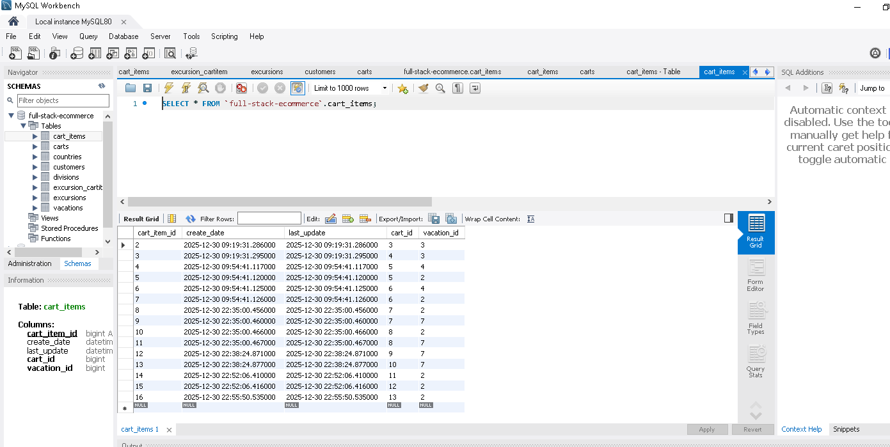
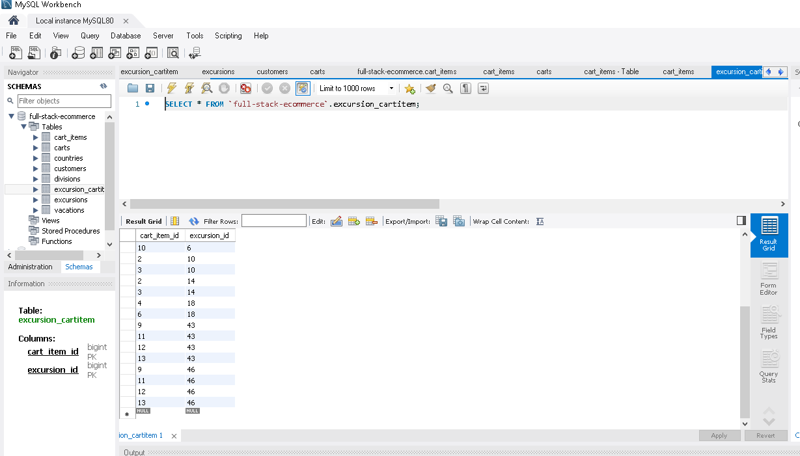

# Vacation Booking Website - Spring Boot Backend

## Overview

A travel agency's Angular vacation-booking front end was left running on a legacy, undocumented backend with no remaining support. This project rebuilds that backend from scratch on the Spring framework as a minimum viable product, without modifying the provided front end.

The finished application allows a user browse available vacation packages, add a new customer directly from the front end (name, address, postal code, phone, country/division), select a party size and a set of add-on excursions for a trip, and complete checkout with the total price calculated dynamically based on party size and selected excursions. On checkout, the backend persists the customer, cart, cart items, and excursion selections to MySQL, and returns an order confirmation with a unique tracking number.

## Features

### Backend Architecture

- Entity classes modeled from the provided UML

- Enum for divisions/countries

- JPA/Hibernate mappings to MySQL

- Repository interfaces extending JpaRepository

- Cross‑origin support for Angular (@CrossOrigin("*"))

- Service layer implementing full purchase + checkout logic

- Automatic tracking number generation

- Input validation matching Angular expectations

### Checkout Logic

- Dynamic price calculation based on:

  - Party size

  - Selected excursions

- Cart summary updates live in Angular

- Backend persists:

  - Customer

  - Cart

  - Cart items

 - Excursion selections

### Database Behavior

- Five sample customers seeded at startup

- No duplicate customer creation on repeated runs

- Full order persistence verified via MySQL Workbench
  
## Tech Stack

- Java 17+
-  Spring Boot (Spring Data JPA, REST Reopsitories)
-  Hibernate
- MySQL
- Lombok
- Angular Front-End (provided by WGU)

## Requirements Summary (From WGU Task)

- Create Spring Boot project with required dependencies 

- Build packages: controllers, entities, dao, services, config

- Implement entities matching UML

- Implement repositories

- Implement service layer (checkout + purchase flow)

- Connect to MySQL

- Integrate with Angular front-end

## Checkout Flow
An order was placed for a vacation package with two excursions using the unmodified Angular front end. The images below show the completed order generating no network errors, along with the resulting database records in MySQL Workbench confirming the data was saved successfully.

---

---

---

---

**Verified clean network activity (no errors) on order submission:**

**Database records confirming the order was persisted (MySQL Workbench):**

---

---

---

